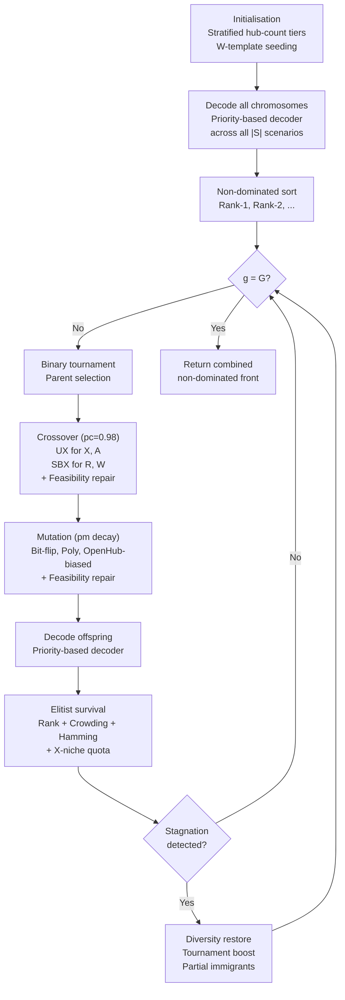
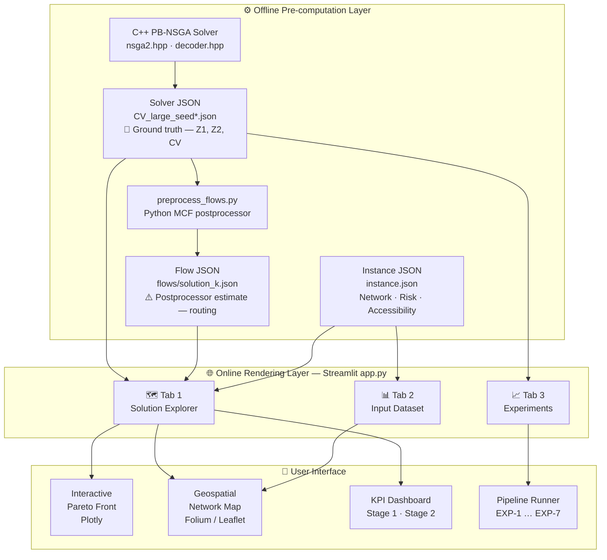
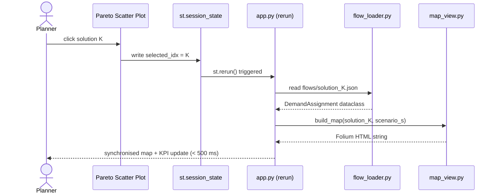

Now I have everything needed. Let me address the Chapter 4 pushback first -- it is short and important -- then write Chapter 3 in full.

---

## Chapter 4 pushback before you commit

**On using v1 numbers: accept with one condition.** Using the accepted CITA results is scientifically defensible because they are peer-reviewed and publicly committed to at a conference. The only condition is that you add one explicit sentence in §4.1 or a footnote stating: "The experimental results reported in Sections 4.2 and 4.3 correspond to dataset version v1 (canonical synthetic instances). A revised dataset (v2, OSRM-validated accessibility matrix and updated vulnerability calibration) was developed during this thesis work but final re-runs fell outside the submission timeline; v2 methodology is described in Section 4.1 and constitutes a direction for immediate future work." This is honest, not embarrassing -- it shows scientific maturity and clearly distinguishes your methodological contribution (v2 dataset design) from the experimental validation (v1 results).

**On the MILP collapse:** do not describe this in the thesis unless you can explain it. "MILP dominated all others with HV=0 for everyone else" without a root-cause explanation is an open wound. The most likely causes are (a) the v2 accessibility matrix changed the feasible region such that the reference front used for HV normalization is far from where v1 baselines converge, or (b) a normalization bug in the HV computation when the reference point shifts. Either way, a result you cannot explain should not appear in a defended thesis. The CITA v1 numbers are clean -- use them.

**On adding dataset construction (§4.1 "Synthesis Dataset Construction"):** strongly support this. It is your original contribution and it requires no new experiment results. It should cover: node selection methodology (administrative centroid sources), hub candidate criteria (real logistics facilities), supply origin selection (seaports, river terminals, border depots), flood vulnerability scoring method (the multi-criteria approach), accessibility matrix construction (OSRM routing vs Delaunay fallback), and scenario generation (the SAA profile bank). This section can be 1--1.5 pages and is fully writeable now.

**On baseline descriptions:** also support adding these. One paragraph per baseline covering what algorithm it is, what the implementation adapts from, and why it is a meaningful comparator. These exist in the CITA paper text and need only modest expansion.

---

Now Chapter 3 in full.

---

# Chapter 3

CHAPTER 3: PROPOSED APPROACHES

This chapter presents the three interlocking components of the proposed solution framework for flood disaster relief network design. The fundamental planning question addressed is: given a region where road infrastructure will be partially severed by flooding, where should rescue hubs be pre-established and how much emergency stock should each carry, such that the resulting network can efficiently evacuate isolated victim populations across a range of plausible flood severities?

To answer this question operationally, decisions are separated into two stages aligned with the disaster timeline. In the first stage, conducted before any disaster strikes, planners commit to long-horizon infrastructure decisions: which candidate sites are activated as planned hubs, and how much emergency stock (food, water, medical supplies, rescue equipment) is pre-positioned at each. These commitments are expensive, irreversible, and must hedge against uncertainty -- a hub opened at the wrong location wastes resources; a hub not opened where it is needed leaves populations stranded. In the second stage, after a specific flood scenario unfolds and the actual pattern of road disruptions, victim locations, and supply availability becomes known, the network responds: rescue teams are dispatched to isolated communes, demand nodes are assigned to reachable active hubs, supplies are routed from external origins, and emergency reactive hubs may be opened if pre-planned capacity proves insufficient. The mathematical formulation capturing this structure is the Multi-Objective Incomplete Hub Location Network Design Problem (MO-IHLNDP), formalised in Section 3.1. The meta-heuristic algorithm solving it efficiently is PB-NSGA, described in Section 3.2. The interactive geospatial Decision Support System translating the optimisation outputs into actionable intelligence for policymakers is introduced in Section 3.3.

## 3.1 Mathematical Formulation

<!-- ## Addition to 3.1 -- Two-Stage Stochastic Programming framing (insert before 3.1.1) -->

The MO-IHLNDP is formulated as a two-stage stochastic program \cite{birge2011stochastic}. Two-stage stochastic programming is the natural mathematical framework for planning problems where some decisions must be committed to before uncertainty is resolved, while others can be deferred until the true state of the world becomes known. The canonical terminology distinguishes "here-and-now" decisions -- made under uncertainty in Stage 1 -- from "wait-and-see" recourse decisions -- made in Stage 2 after a specific scenario $s \in \mathcal{S}$ realises with probability $\pi_s$. Uncertainty is represented as a finite scenario set whose probability distribution is estimated from historical and synthetic data.

In MO-IHLNDP, Stage 1 encodes the pre-disaster preparedness investments that must be committed before any flood event: which hub sites to activate ($x_k$) and how much emergency stock to pre-position at each ($q_k$). These decisions incur certain costs regardless of which scenario subsequently occurs. Stage 2 encodes the scenario-dependent rescue operations: demand communes are assigned to reachable active hubs ($z_{iks}$), supply is routed from external origins ($z_{jks}$), inter-hub transshipments redistribute surplus inventory ($f_{khms}$), and emergency reactive hubs are opened where pre-planned coverage fails ($y_{ks}$). The Stage 2 problem is re-solved independently for each scenario $s$, adapting to the realised road accessibility matrix, risk indices, demand volumes, and supply availability.

The two-stage structure is preferred over a deterministic model -- which would solve a single nominal scenario and commit to a plan that may fail under deviation -- and over robust optimisation -- which typically optimises the worst-case scenario without exploiting the probability structure of the scenario distribution \cite{rawls2010prepositioning, tofighi2016humanitarian}. By weighting second-stage outcomes by $\pi_s$, the stochastic program balances expected cost efficiency across the full scenario distribution, while the $\max_{i}$ operator in $Z_2$ (Section 3.1.2) ensures that equity is evaluated under the worst-case demand within each scenario. This combination -- probabilistic expectation at the scenario level, Rawlsian maximin at the demand level -- is the mathematical expression of the operational intent: plan cost-efficiently on average, but guarantee that no community is catastrophically left behind in any realised scenario.

<!-- Rewrite once again -->
**3.1 Mathematical Formulation for the MO-IHLNDP**

We formulate the Multi-Objective Incomplete Hub Location Network Design Problem (MO-IHLNDP) as a two-stage stochastic program \cite{birge1997introduction}. The network comprises supply origins, demand communes, and candidate hubs. Uncertainty is modeled via a finite set of scenarios $\mathcal{S}$, where each scenario $s \in \mathcal{S}$ occurs with a discrete probability $\pi_s$. Specifically, the stochastic parameter vector for each scenario is defined as $\xi_s = (D_{is}, O_{js}, a_{uvms}, r_{us})$, capturing the realized victim demand, supply availability, structural arc accessibility, and node-specific flood risk indices, respectively.

The two-stage structure is adopted under the assumption that tactical response decisions occur immediately following the flood realization but before subsequent temporal evolution, making a multi-stage representation unnecessary for this specific operational window. Stage 1 variables—comprising planned hub establishment ($x_k$) and inventory pre-positioning ($q_k$)—are scenario-independent, satisfying the non-anticipativity constraint. These strategic investments must be strictly committed prior to the observation of $\xi_s$.

Stage 2 models the scenario-specific recourse decisions conditional on the realization of $\xi_s$. These include the activation of emergency reactive hubs ($y_{ks}$), the assignment of demand nodes to functional hubs ($z_{iks}$), origin-to-hub supply routing ($z_{jks}$), and lateral transshipments ($f_{khms}$). The optimization model evaluates the expected performance of these recourse operations over the entire scenario distribution $\mathcal{S}$ to determine the optimal Stage 1 configuration.

The formulation balances expected cost efficiency with social equity. The first objective ($Z_1$) optimizes the expected total logistics cost across all scenarios. To address equity, the second objective ($Z_2$) employs a minimax formulation that minimizes the maximum deprivation cost experienced by any demand node within a scenario. While this objective cannot theoretically guarantee absolute service coverage under severe capacity or physical accessibility constraints, it operationalizes equity by strictly measuring and penalizing the worst-case deprivation. This mechanism mathematically forces the model to prioritize the most isolated and vulnerable populations during extreme disruptions.


### 3.1.1 Sets, Indices, Parameters, and Decision Variables

The MO-IHLNDP is defined over a network $\mathcal{V} = \mathcal{H} \cup \mathcal{I} \cup \mathcal{J}$, where $\mathcal{H}$, $\mathcal{I}$, and $\mathcal{J}$ denote the index sets of hub candidates, demand communes, and supply origins respectively, with individual elements indexed by $k, h \in \mathcal{H}$, $i \in \mathcal{I}$, and $j \in \mathcal{J}$. Disaster scenarios are indexed by $s \in \mathcal{S}$ with occurrence probability $\pi_s$, and transport modes (truck, motorboat, helicopter) are indexed by $m \in \mathcal{M}$.

**Table 3-1: First-Stage Parameters (Pre-Disaster Strategic Planning)**

| Symbol | Description |
|---|---|
| $F_k$ | Fixed cost to establish planned hub $k$ |
| $c_k,\ \kappa_k$ | Unit holding cost and inventory capacity at hub $k$ |
| $\alpha$ | Economies-of-scale discount factor for inter-hub flows ($\alpha < 1$) |
| $\chi$ | Maximum acceptable risk threshold for hub activation |
| $C_{uvm},\ \tau_{uvm}$ | Unit transport cost and travel time from node $u$ to $v$ via mode $m$ |
| $C_m,\ Q_m$ | Unit local routing cost and vehicle capacity for mode $m$ |
| $\Phi,\ \eta,\ A_i$ | Daganzo circuity factor, average group size per distress location, and area of demand zone $i$ |
| $\gamma$ | Average relief items required per evacuated person (kg/person) |

**Table 3-2: Second-Stage Parameters (Scenario-Dependent Response)**

| Symbol | Description |
|---|---|
| $\pi_s$ | Probability of scenario $s$ |
| $F^a_{ks}$ | Fixed cost to activate a reactive hub $k$ in scenario $s$ |
| $\tau_{ks}$ | Processing time per rescue round trip at hub $k$ in scenario $s$ |
| $a_{uvms} \in \{0,1\}$ | Arc accessibility: 1 if arc $(u,v)$ is traversable via mode $m$ in scenario $s$ |
| $r_{us}$ | Flood risk index of node $u$ in scenario $s \in [0,1]$ |
| $v_{ks} \in \{0,1\}$ | Planned-hub availability indicator: $v_{ks} = 1 \Leftrightarrow r_{ks} \leq \chi$ |
| $\lambda_{is}$ | Deprivation sensitivity: $\lambda_{is} = \lambda_0(1 + r_{is})$ |
| $D_{is},\ O_{js}$ | Victim demand at commune $i$ and supply available at origin $j$ in scenario $s$ |
| $c_{jks}$ | Pre-computed cheapest transport cost from origin $j$ to hub $k$: $\min_{m \mid a_{jkms}=1} C_{jkm}$ |
| $\Theta_{kis}$ | Daganzo continuous approximation last-mile routing cost (see Section 3.1.2) |

**Table 3-3: Decision Variables**

| Symbol | Type | Description |
|---|---|---|
| $x_k \in \{0,1\}$ | First-stage binary | 1 if planned hub $k$ is established |
| $y_{ks} \in \{0,1\}$ | Second-stage binary | 1 if reactive hub $k$ is opened in scenario $s$ |
| $z_{iks} \in \{0,1\}$ | Second-stage binary | 1 if demand $i$ is assigned to hub $k$ in scenario $s$ |
| $z_{jks} \in \{0,1\}$ | Second-stage binary | 1 if origin $j$ supplies hub $k$ in scenario $s$ |
| $q_k \geq 0$ | First-stage continuous | Pre-positioned inventory at hub $k$ (kg) |
| $f_{khms} \geq 0$ | Second-stage continuous | Inter-hub transshipment from $k$ to $h$ via mode $m$ in scenario $s$ |
| $W_s \geq 0$ | Second-stage continuous | Auxiliary variable bounding maximum deprivation per scenario $s$ |

### 3.1.2 Objective Functions

**Objective 1 -- Minimize Total Expected Logistics Cost ($Z_1$)**

$$Z_1 = \underbrace{\sum_{k \in \mathcal{H}} F_k x_k + \sum_{k \in \mathcal{H}} c_k q_k}_{\text{Pre-disaster strategic costs}} + \sum_{s \in \mathcal{S}} \pi_s \left[ \underbrace{\sum_{k \in \mathcal{H}} F^a_{ks} y_{ks}}_{\text{Reactive setup}} + \underbrace{\sum_{j \in \mathcal{J}} \sum_{k \in \mathcal{H}} c_{jks} O_{js} z_{jks}}_{\text{Origin-to-hub supply flow}} + \underbrace{\sum_{k,h \in \mathcal{H}} \sum_{m \in \mathcal{M}} \alpha C_{khm} f_{khms}}_{\text{Inter-hub transshipment}} + \underbrace{\sum_{k \in \mathcal{H}} \sum_{i \in \mathcal{I}} \Theta_{kis} z_{iks}}_{\text{Last-mile CA routing}} \right] \#()$$

The objective aggregates costs across three horizons. Pre-disaster costs are incurred regardless of which scenario realizes: hub establishment ($F_k x_k$) and inventory holding ($c_k q_k$). Post-disaster recourse costs are probability-weighted expectations: reactive hub setup fees ($F^a_{ks}$), supply procurement and transport from external origins ($c_{jks} O_{js} z_{jks}$), discounted inter-hub lateral transshipments with economies of scale factor $\alpha < 1$, and last-mile routing from each hub to its assigned communes.

The last-mile cost $\Theta_{kis}$ is pre-computed using Daganzo's continuous approximation (CA) \cite{daganzo2005logistics}, which avoids the computational burden of explicit vehicle routing. It decomposes into two components:

$$\Theta_{kis} = \min_{m \in \mathcal{M} \mid a_{ikms}=1} \left[ \underbrace{2 \cdot C_{kim} \cdot \left\lceil \frac{D_{is}}{Q_m} \right\rceil}_{\text{Line-haul}} + \underbrace{C_m \cdot \Phi \sqrt{\left\lceil \frac{D_{is}}{\eta} \right\rceil \cdot A_i}}_{\text{Local routing}} \right] \#()$$

The line-haul term captures the cost of vehicle round-trips between hub $k$ and the centroid of demand zone $i$: a vehicle travels from hub to zone and returns, at unit cost $C_{kim}$, requiring $\lceil D_{is}/Q_m \rceil$ trips to collect all $D_{is}$ evacuees in vehicles of capacity $Q_m$. The factor 2 reflects the out-and-back nature of rescue dispatch. The local routing term uses Daganzo's CA formula for the expected cost of collecting $\lceil D_{is}/\eta \rceil$ spatially distributed distress groups within a zone of area $A_i$, where $\eta$ is the average group size per location and $\Phi$ is a circuity factor reflecting road geometry deviations from straight-line distance.

**Objective 2 -- Minimize Expected Maximum Deprivation Cost ($Z_2$)**

$$Z_2 = \sum_{s \in \mathcal{S}} \pi_s \left( \max_{i \in \mathcal{I}} \left[ D_{is} \cdot \left( e^{\lambda_{is} \cdot \Omega_{is}} - 1 \right) \right] \right) \#()$$

where the total rescue waiting time for demand $i$ in scenario $s$ is:

$$\Omega_{is} = \sum_{k \in \mathcal{H}} z_{iks} \left( \tau_{ks} + 2 \cdot \min_{m \in \mathcal{M} \mid a_{ikms}=1} \tau_{kim} \right) \#()$$

The deprivation cost function, introduced by Holguín-Veras et al. \cite{holguin2013appropriate}, quantifies human suffering as an exponential function of waiting time. Unlike linear penalty functions, the exponential form reflects the empirical observation that suffering escalates nonlinearly as rescue delay accumulates. The vulnerability-adjusted sensitivity coefficient $\lambda_{is} = \lambda_0 (1 + r_{is})$ ensures that communes with higher flood risk exposure face steeper deprivation penalties for the same delay, mathematically prioritising the most exposed populations.

The waiting time $\Omega_{is}$ decomposes into two operationally interpretable components. The hub processing time $\tau_{ks}$ represents the time required to organise and dispatch a rescue round trip at hub $k$ under scenario $s$; this reflects hub-level operational readiness and may degrade under severe flooding conditions. The travel component $2 \cdot \min_m \tau_{kim}$ is the minimum achievable round-trip travel time between hub $k$ and commune $i$ over available transport modes -- the factor 2 again reflecting the rescue team's outbound trip to isolated communities and return with evacuees.

The structure of $Z_2$ encodes a Rawlsian justice principle \cite{rawls1971theory}: the $\max_{i}$ operator ensures the objective is governed by the worst-off commune in each scenario, not by the average. Any solution that neglects even a single isolated commune -- allowing it to wait disproportionately long while others are served efficiently -- incurs a disproportionate penalty. This forces the optimizer to distribute rescue capacity equitably rather than concentrating it where logistics costs are minimised. The two objectives $Z_1$ (cost efficiency) and $Z_2$ (equity) are inherently conflicting: resources sufficient to guarantee equity under extreme scenarios cost far more than those sufficient for mild conditions. The Pareto front of MO-IHLNDP makes this trade-off explicit and quantified.

To tractably solve the model, $Z_2$ is linearised by exploiting the single-allocation property. Since each demand commune is assigned to exactly one hub (Constraint (8)), the exponential deprivation cost $C^{\text{dep}}_{iks}$ for the assignment $(i, k, s)$ can be pre-computed:

$$C^{\text{dep}}_{iks} = D_{is} \cdot \left( e^{\lambda_{is} \cdot (\tau_{ks} + 2 \cdot \min_{m \mid a_{ikms}=1} \tau_{kim})} - 1 \right) \#()$$

Introducing the auxiliary variable $W_s \geq 0$ to bound the worst-case deprivation within each scenario, the linearised form is:

$$Z^{\text{linear}}_2 = \sum_{s \in \mathcal{S}} \pi_s W_s \qquad \text{subject to:} \qquad W_s \geq C^{\text{dep}}_{iks} \cdot z_{iks} \quad \forall i \in \mathcal{I},\ k \in \mathcal{H},\ s \in \mathcal{S} \#()$$

The joint problem minimises $Z_1$ and $Z^{\text{linear}}_2$ subject to the constraints in Section 3.1.3.

### 3.1.3 Constraints

The complete MO-IHLNDP is stated as:

$$\text{Minimise} \quad Z_1,\quad Z^{\text{linear}}_2 \qquad \text{subject to Constraints (3.7)--(3.18)}$$

**Hub establishment and safe-zone placement.** Three constraints govern which hubs are operationally available in each scenario:

$$x_k + y_{ks} \leq 1 \qquad \forall k \in \mathcal{H},\ s \in \mathcal{S} \#()$$

$$q_k \leq \kappa_k \cdot x_k \qquad \forall k \in \mathcal{H} \#()$$

$$r_{ks} \cdot y_{ks} \leq \chi \qquad \forall k \in \mathcal{H},\ s \in \mathcal{S} \#()$$

Constraint (3.7) enforces mutual exclusivity between planned and reactive hub types: a site cannot simultaneously be a planned hub ($x_k=1$) and a reactive hub ($y_{ks}=1$) in the same scenario, since reactive hubs are intended as emergency fallback facilities at sites not invested in during the preparedness phase. Constraint (3.8) bounds pre-positioned inventory at planned hubs by their physical capacity $\kappa_k$, and ensures no inventory is allocated to unopened hubs ($x_k=0$). Constraint (3.9) restricts reactive hub opening to sites whose scenario-specific risk index $r_{ks}$ does not exceed the safety threshold $\chi$: reactive hubs cannot be established at sites that will themselves be flooded or rendered operationally inaccessible. The binary parameter $v_{ks} = \mathbf{1}[r_{ks} \leq \chi]$ pre-computes this indicator for planned hubs and is used in the assignment constraints below.

**Single allocation and reachability.** Demands and origins must each be assigned to exactly one hub, through available arcs, and only to operationally active hubs:

$$\sum_{k \in \mathcal{H}} z_{iks} = 1 \qquad \forall i \in \mathcal{I},\ s \in \mathcal{S} \#()$$

$$\sum_{k \in \mathcal{H}} z_{jks} = 1 \qquad \forall j \in \mathcal{J},\ s \in \mathcal{S} \#()$$

$$z_{iks},\ z_{jks} \leq v_{ks} \cdot x_k + y_{ks} \qquad \forall i \in \mathcal{I},\ j \in \mathcal{J},\ k \in \mathcal{H},\ s \in \mathcal{S} \#()$$

$$z_{iks} \leq \sum_{m \in \mathcal{M}} a_{ikms} \qquad \forall i \in \mathcal{I},\ k \in \mathcal{H},\ s \in \mathcal{S} \#()$$

$$z_{jks} \leq \sum_{m \in \mathcal{M}} a_{jkms} \qquad \forall j \in \mathcal{J},\ k \in \mathcal{H},\ s \in \mathcal{S} \#()$$

Constraints (3.10) and (3.11) enforce single allocation: every demand commune and every supply origin is served through exactly one hub in each scenario. Constraint (3.12) links assignments to hub availability using the $v_{ks}$ indicator for planned hubs and $y_{ks}$ for reactive hubs -- a demand or origin can only be assigned to hub $k$ in scenario $s$ if that hub is actually operational in that scenario. Critically, for planned hubs with $r_{ks} > \chi$, we have $v_{ks}=0$, so the assignment is blocked even though $x_k=1$; this is the mechanism by which high-risk planned hubs are rendered inactive in severe scenarios without requiring any second-stage binary variable to encode deactivation. Constraints (3.13) and (3.14) enforce network reachability: an assignment is only feasible if at least one transport mode provides an accessible arc between the assigned pair -- if floods have severed all routes from commune $i$ to hub $k$ under scenario $s$, the assignment $z_{iks}=1$ is infeasible regardless of hub availability.

**Flow conservation and capacity.** Inter-hub transshipment and supply flows must respect arc accessibility, flow balance, and hub throughput limits:

$$f_{khms} \leq M \cdot a_{khms} \qquad \forall k, h \in \mathcal{H},\ m \in \mathcal{M},\ s \in \mathcal{S} \#()$$

$$\sum_{i \in \mathcal{I}} \gamma D_{is} z_{iks} + \sum_{h \in \mathcal{H}} \sum_{m \in \mathcal{M}} f_{khms} \leq q_k + \sum_{j \in \mathcal{J}} O_{js} z_{jks} + \sum_{h \in \mathcal{H}} \sum_{m \in \mathcal{M}} f_{hkms} \qquad \forall k \in \mathcal{H},\ s \in \mathcal{S} \#()$$

$$q_k + \sum_{j \in \mathcal{J}} O_{js} z_{jks} + \sum_{h \in \mathcal{H}} \sum_{m \in \mathcal{M}} f_{hkms} \leq \kappa_k \cdot (x_k + y_{ks}) \qquad \forall k \in \mathcal{H},\ s \in \mathcal{S} \#()$$

Constraint (3.15) blocks transshipment on any inter-hub arc that is inaccessible under scenario $s$, using a Big-M formulation. Constraint (3.16) is the flow conservation inequality at each hub: the total outgoing demand (converted to relief items via $\gamma$ kg/person) plus outgoing transshipments must not exceed the total available supply -- comprising pre-positioned inventory $q_k$, external origin deliveries, and incoming transshipments from other hubs. The inequality (rather than equality) permits excess supply to remain at a hub, which is physically realistic. Constraint (3.17) imposes throughput capacity: the total supply entering hub $k$ from all sources must not exceed its physical capacity $\kappa_k$ when active.

**Variable domains.**

$$x_k,\ y_{ks},\ z_{iks},\ z_{jks} \in \{0,1\} \qquad \forall i,j,k,s \#()$$

$$q_k,\ f_{khms},\ W_s \geq 0 \qquad \forall k,h,m,s \#()$$

**Interpretation and problem setting.** The constraint system encodes two distinct classes of network flexibility that together constitute the model's operational realism. The first is spatial flexibility through incomplete topology: constraints (3.13)--(3.15) condition all assignments and flows on scenario-specific arc accessibility, explicitly modelling the partial connectivity that characterises flood-affected networks. Unlike classical hub location models that assume all arcs are always traversable, MO-IHLNDP routes are contingent -- an assignment or transshipment feasible under mild flooding may become infeasible under extreme conditions as additional road links are severed. This is not a conservative modelling choice but a structural necessity: any model assuming full connectivity will generate plans that fail when realised flood conditions sever key arteries.

The second is temporal flexibility through the two-stage structure: first-stage decisions ($x_k$, $q_k$) are fixed before uncertainty resolves and provide the structural skeleton of the network, while second-stage decisions ($y_{ks}$, $z_{iks}$, $z_{jks}$, $f_{khms}$) adapt to each realised scenario. The reactive hub variable $y_{ks}$ is the key recourse mechanism: it allows the network to partially compensate for capacity shortfalls that emerge when planned hubs are risk-deactivated ($v_{ks}=0$) or when demand exceeds pre-positioned inventory. The cost of reactive hub setup ($F^a_{ks}$ in $Z_1$) creates an economic pressure for adequate first-stage investment -- the model optimally trades the certain cost of pre-positioning against the expected cost of reactive recourse across scenarios weighted by $\pi_s$.

## 3.2 Proposed Algorithm: PB-NSGA

The MO-IHLNDP is NP-hard, as its single-objective single-scenario relaxation subsumes the uncapacitated facility location problem \cite{mirchandani1990discrete}. We propose PB-NSGA (Priority-Based Nondominated Sorting Genetic Algorithm), which embeds the NSGA-II framework \cite{deb2002fast} with a custom priority-based heuristic decoder. The key architectural insight is search-space separation: instead of encoding all decision variables in the chromosome -- which would require $|\mathcal{S}| \times |\mathcal{V}|$ genes and make the search space grow with the number of scenarios -- the chromosome encodes only the first-stage decisions $(x_k, q_k)$ and a compact set of heuristic decoder weights. All second-stage decisions are reconstructed deterministically by the decoder, reducing the effective search-space complexity from $\mathcal{O}(|\mathcal{S}| \times |\mathcal{V}|)$ to $\mathcal{O}(|\mathcal{H}| + |\mathcal{I}|)$ \cite{gen2006priority}.

### 3.2.1 Chromosome Encoding Scheme

Each chromosome $\mathbf{C} = (X, R, A, W)$ consists of four concatenated segments of total length $2|\mathcal{H}| + |\mathcal{I}| + 6$:

- $X \in \{0,1\}^{|\mathcal{H}|}$: binary vector determining planned hub establishment. $X[k]=1$ opens hub $k$; $X[k]=0$ keeps it closed.
- $R \in [0,1]^{|\mathcal{H}|}$: continuous vector defining inventory fill fractions, setting $q_k = R[k] \cdot \kappa_k$. For closed hubs ($X[k]=0$), $R[k]$ is genetically present but decoded to zero.
- $A \in \{0, \ldots, |\mathcal{H}|-1\}^{|\mathcal{I}|}$: integer vector encoding the preferred anchor hub for each demand node $i$. $A[i]$ is the local index of a hub toward whose geographic neighborhood demand $i$ should be preferentially assigned during decoding.
- $W \in [0,1]^6$: continuous vector containing six heuristic weights governing decoder behaviour, with the following semantics:

| Gene | Role |
|---|---|
| $W[0]$ | Urgency weight in demand priority scoring ($\lambda \cdot D$) |
| $W[1]$ | Speed weight in hub selection score ($1/\tau$); hard-capped at 0.40 |
| $W[2]$ | Residual capacity weight in hub selection score |
| $W[3]$ | Isolation weight in demand priority scoring ($1/N_{\text{reach}}$) |
| $W[4]$ | Planned-hub preference bonus in hub selection score |
| $W[5]$ | K-window depth fraction: $K = \max(1, \lceil W[5] \cdot |\mathcal{H}| \rceil)$ |

The $W$ vector evolves jointly with $(X, R, A)$, allowing the algorithm to adapt its decoding strategy to the problem landscape. The hard cap on $W[1] \leq 0.40$ was established empirically: unconstrained $W[1]$ evolution causes a speed-dominant trap in which all demand nodes converge on the fastest-access hub regardless of capacity, producing infeasible over-allocation (see Section 3.2.3). $W[5]$ controls the breadth of the K-window pass in hub assignment: $K=1$ degenerates to a feasibility check at the anchor hub alone, while $K=|\mathcal{H}|$ collapses load distribution by directing all demands to the single globally highest-scoring hub. Empirical calibration identifies $W[5] \in [0.40, 0.55]$ (yielding $K=2$--$3$ for $|\mathcal{H}|=5$) as the effective optimum for the Central Vietnam instances.

For CV-Small (5 hubs, 20 demand nodes) the chromosome has 36 genes; for CV-Large (20 hubs, 100 demand nodes) it has 146 genes.

### 3.2.2 Priority-Based Decoding Heuristic

The decoder is the core contribution of PB-NSGA. Given chromosome $\mathbf{C}$ and instance data, it reconstructs all scenario-dependent second-stage decisions deterministically, returning objective values $(Z_1, Z_2)$ and a constraint violation count CV. It is invoked once per chromosome per fitness evaluation, iterating over all $|\mathcal{S}|$ scenarios. Algorithm 3-1 formalises the procedure.

**Algorithm 3-1: Priority-Based Decoder (single scenario $s$)**

```
Require: Chromosome C = (X, R, A, W), scenario s, instance data
Ensure: (Z1_s, Z2_s, CV_s)

Step 1 -- Stage-1 decoding:
  x[k] = X[k]; q[k] = R[k] × κ[k] for all k

Step 2 -- Scenario hub activation:
  H_act ← { k : X[k]=1 AND risk[k][s] ≤ χ }
  if H_act = ∅: force-activate k* = argmin_k risk[k][s] among {k : X[k]=1}

Step 3 -- Demand priority scoring:
  For each i: score[i] = W[0]×urgency_norm[i] + W[3]×isolation_norm[i] − W[1]×dist_norm[i]
  Sort demands in descending score order

Step 4 -- Three-pass tiered allocation (for each demand i in priority order):
  K ← max(1, ⌈W[5] × |H|⌉); trial_order ← hub_anchor_order[A[i] mod |H|]
  Pass 1: score top-K hubs in trial_order; assign to best feasible hub with residual > 0
  Pass 2: score remaining |H|−K hubs in trial_order; assign to best feasible hub
  Pass 3 (reactive fallback): if no active/reactive hub reachable,
          open nearest safe inactive hub (risk[k][s] ≤ χ); add F^a_{ks}; CV_s += 1

Step 5 -- MCF supply routing:
  Solve exact minimum-cost flow: origins → active hubs → hub-to-hub transshipment
  Accumulate supply flow costs into Z1_s

Step 6 -- Objective accumulation:
  Z1_s += Σ_i Θ_{k*(i),i,s} + reactive setup costs
  Z2_s = max_i [C_dep(i, k*(i), s)]

Return (Z1_s, Z2_s, CV_s)
```

**Step 1 -- Stage-1 decoding** extracts the first-stage commitments from the chromosome: hub establishment indicators $x[k] = X[k]$ and pre-positioned inventory $q[k] = R[k] \cdot \kappa_k$. The fixed cost component of $Z_1$ is accumulated once, outside the scenario loop, since it is scenario-independent.

**Step 2 -- Scenario hub activation** determines which planned hubs are operationally viable under scenario $s$ by applying the risk threshold $\chi$: hub $k$ is active iff $X[k]=1$ and $r_{ks} \leq \chi$. This implements the availability indicator $v_{ks}$ from the mathematical model. If no planned hub clears the threshold -- possible under extreme scenarios with high universal risk -- the safest hub (minimum $r_{ks}$) is force-activated to guarantee a feasible allocation basis.

**Step 3 -- Demand priority scoring** computes a composite priority score for each demand node, reflecting three independent concerns: urgency ($\lambda_{is} \cdot D_{is}$, high for vulnerable populous communes), isolation (reciprocal of the number of reachable active hubs, high for communes with few service options), and proximity (minimum travel time to any active hub, lower is better, subtracted from the score). All three components are independently normalised to $[0,1]$ before weighting. Demands are processed in descending score order, ensuring the most urgent, isolated, and remote communes are served first -- before capacity is exhausted by easier-to-serve nodes.

**Step 4 -- Three-pass tiered allocation** is the most technically novel component of the decoder. For each demand node $i$ (in priority order), the decoder attempts assignment through three successively relaxed passes:

Pass 1 searches the top-$K$ hubs in the anchor-sorted trial order $\pi_{A[i]}$ (hubs sorted by proximity to anchor hub $A[i]$, not to demand $i$ itself -- a design choice that enables implicit load partitioning across geographic hub neighbourhoods). Within this K-window, hubs are scored by $W[1] \cdot \text{speed\_norm} + W[2] \cdot \text{residual\_norm} + W[4] \cdot \text{planned\_bonus}$, where speed\_norm and residual\_norm are normalised to $[0,1]$ on a per-demand basis to ensure commensurable scales. The best-scoring hub with positive residual capacity is selected.

Pass 2 extends the search to the remaining $|\mathcal{H}|-K$ hubs in trial order, using the same scoring function. Pass 2 is a quality-preserving fallback -- the entire K-tail is evaluated and the best-scoring feasible hub wins -- rather than a first-found greedy fallback. This distinction is operationally significant: before the scored Pass 2 was introduced, seeds with small $K$ and suboptimal anchor assignments produced systematically suboptimal allocations because the K-tail was never quality-compared.

Pass 3 is the reactive hub fallback, reached only when no active or reactive hub is reachable from demand $i$ via any available transport mode. The decoder opens the nearest safe inactive hub ($r_{ks} \leq \chi$) as a reactive site, incurring its setup cost $F^a_{ks}$ and incrementing CV. If no such hub exists, the demand is marked infeasible.

**Step 5 -- MCF supply routing** solves an exact minimum cost flow (MCF) subproblem per scenario once all demand assignments are fixed. The MCF network has super-source, origin nodes, active hub nodes, and super-sink, with arcs: SRC $\to$ ORG$_j$ (capacity $O_{js}$, zero cost), ORG$_j$ $\to$ HUB$_k$ (capacity $O_{js}$, cost $c_{jks}$, conditional on arc accessibility), and HUB$_k$ $\to$ HUB$_h$ (cost $\alpha C_{khs}$, conditional on inter-hub arc accessibility). This exact solving of the supply routing subproblem ensures $Z_1$ is minimised to near-optimality for any decoded hub configuration, and is a key driver of PB-NSGA's solution quality \cite{ford1962flows}.

**Step 6 -- Objective accumulation** completes the scenario evaluation: $Z_1$ accumulates last-mile routing costs ($\Theta_{k^*(i),i,s}$) for all demand assignments; $Z_2$ for this scenario is $\max_i C^{\text{dep}}_{ik^*s}$. The exponent is capped at 20 to prevent floating-point overflow. Accumulated per-scenario values are weighted by $\pi_s$ at the end of the scenario loop.

### 3.2.3 Genetic Operators

**Initialisation.** The initial population of $N$ chromosomes is seeded via a stratified hub-count tier schedule to ensure coverage of the full hub-count spectrum from sparse to dense configurations. Tier 0 opens $n \in [1, \lfloor \text{max}/3 \rfloor]$ hubs, Tier 1 opens $n \in [\lfloor \text{max}/3 \rfloor, \lfloor 2\text{max}/3 \rfloor]$, and Tier 2 opens $n \in [\lfloor 2\text{max}/3 \rfloor, \text{max}]$ hubs, where max $= \lfloor 0.6 \cdot |\mathcal{H}| \rfloor$. Hub selection within tiers is biased toward lower fixed-cost candidates. $R$ values are drawn from $\text{Uniform}(0.45, 0.95)$ for open hubs and $\text{Uniform}(0.0, 0.25)$ for closed hubs. Each $A[i]$ is initialised to the nearest open hub with 80\% probability, random otherwise. $W$ vectors are initialised from four empirically calibrated templates with $\pm 0.10$ perturbation, all satisfying $W[1] \leq 0.20$ and $W[5] \in [0.40, 0.55]$.

**Crossover**, applied with probability $p_c = 0.98$, uses segment-specific operators. Uniform crossover (each locus swapped with probability 0.5) is applied to the binary $X$ and integer $A$ segments. Simulated Binary Crossover (SBX, $\eta_c = 1.5$) is applied to the continuous $R$ and $W$ segments; the low distribution index ($\eta_c = 1.5$ versus the standard $20$) was selected to produce broadly exploratory offspring distributions, reflecting the large solution landscape of MO-IHLNDP. After crossover, two feasibility repairs are applied unconditionally: (1) if all $X[k]=0$, one random hub is forced open; (2) any $A[i]$ pointing to a closed hub in the offspring's $X$ is immediately redirected to a random open hub, preventing anchor mismatches from generating systematic Pass 1 failures. Additionally, $W[1]$ is hard-clamped to 0.40 post-crossover.

**Mutation**, applied unconditionally to every offspring, uses a linearly decaying base rate $p_m$ from $p^{\text{high}}_m = 0.40$ to $p^{\text{low}}_m = 0.10$ over $G$ generations, balancing early exploration with late exploitation. Per-gene mutation probabilities are segment-scaled -- $p_m / |\text{segment}|$ -- so that each segment receives approximately the same expected number of mutations per generation regardless of segment length. This is particularly important for CV-Large where the $A$ segment has 100 genes: without scaling, gene-wise probability of $p_m$ would produce 40 expected mutations per generation in $A$ alone, vastly over-mutating it relative to $X$ and $W$. Bit-flip mutation is applied to $X$; polynomial mutation ($\eta_m = 8$) to $R$ and $W$; and open-hub-biased replacement (probability 0.85 of selecting a random open hub, 0.15 of any hub) to $A$. The open-hub bias was found to increase 5-seed mean HV by 28\% by reducing the frequency of anchor-to-closed-hub mutations that produce immediate Pass 1 failures \cite{audit_algorithm_design}. The same X-alignment repair as in crossover is applied after every X bit-flip.

**Survival** follows the NSGA-II elitist scheme with constrained dominance \cite{deb2002fast}: feasible solutions always dominate infeasible ones; among infeasible individuals, lower CV wins. Among individuals of equal rank and crowding distance, minimum Hamming distance in $X$-space serves as a final tiebreaker, preventing the crowding mechanism from eliminating genotypically diverse hub configurations that are phenotypically similar in objective space.

**Diversity maintenance.** Three mechanisms preserve population diversity beyond standard NSGA-II. An X-niche quota ensures that every unique hub configuration ($X$-vector) present in the combined parent-offspring pool retains at least one representative in the next generation, preventing premature loss of potentially valuable hub topologies through crowding-distance kill. A stagnation detector monitors the set of unique $X$-configurations on the rank-1 front: if unchanged for 20 consecutive generations, tournament size increases from 2-way to 3-way to intensify selection pressure. Under simultaneous low diversity ($\leq 8$ unique $X$-configs) and stagnation, approximately 2\% of the population (with the top 20\% immune) is replaced with freshly initialised individuals, injecting structural genetic diversity without disrupting converged $R/W$ values for established hub topologies.

**Figure 3-X: PB-NSGA Algorithm Flowchart (Mermaid syntax for rendering):**



## 3.3 New
I have enough from the audit file -- no additional queries needed. Two things you need are below: the Mermaid source for Figure 3-A, then a condensed rewrite of the full section.

---

## Figure 3-A: Mermaid source



---

## 3.3 Condensed rewrite

---

3.3 The Interactive Geospatial Decision Support System

3.3.1 Motivation and Value Proposition

The mathematical output of PB-NSGA is a Pareto front of 10 -- 25 non-dominated solutions. Each solution is a complete specification of hub establishment decisions, inventory levels, and scenario-dependent rescue routing -- but in raw vector form, this output is not actionable for a provincial emergency management committee operating within a 24 -- 48 hour pre-typhoon decision window. Three pain points define the gap. First, the cost-deprivation trade-off is abstract without geometric representation: choosing between a cheaper and a fairer plan requires seeing which specific communes are affected, not only aggregate numbers. Second, a hub network is inherently spatial: the strategic value of any hub site can only be assessed on a real map of the region, showing its rescue zone, accessible transport modes, and risk profile under each flood scenario. Third, planners cannot stress-test a solution without seeing how the network adapts as severity escalates from Mild to Extreme -- which hubs deactivate, which communes reroute, which transport modes substitute for severed roads.

The Geospatial DSS, deployed at \texttt{https://drn-viz.streamlit.app}, addresses all three pain points. Its primary value proposition is the transformation of an abstract Pareto front into an interactive spatial planning environment: selecting any solution instantly renders its full geographic configuration on an OpenStreetMap base layer, and toggling across flood scenarios reveals the network's structural adaptation in real time. The system is designed for two simultaneous audiences -- policymakers exploring trade-offs at the defence and stakeholder presentations, and researchers producing and verifying experimental evidence through the same unified interface.

3.3.2 System Architecture

The guiding architectural principle is strict decoupling between heavy offline computation and lightweight interactive rendering, enabling sub-500ms map rendering latencies for the CV-Large instance (100 demand nodes, 20 hubs, 3 scenarios, full multi-modal routing). As shown in Figure 3-A, the system separates into two layers.

The \textbf{Offline Pre-computation Layer} executes all expensive operations before the live application starts. The C++ solver produces ground-truth JSON files containing first-stage decisions and aggregate objective values ($Z_1$, $Z_2$, CV). The \texttt{preprocess\_flows.py} pipeline reads these files and applies a Python replica of the priority-based decoder to reconstruct per-solution, per-scenario routing assignments, serialising results as flow JSON files. This design absorbs the $\mathcal{O}(|\mathcal{S}| \times |\mathcal{I}| \times |\mathcal{H}|)$ assignment computation entirely offline. The data trust model enforces a strict distinction: solver JSON files are immutable ground truth; flow JSON files are labelled "postprocessor estimate" throughout the UI, ensuring users never misinterpret derived routing assignments as direct solver output.

The \textbf{Online Rendering Layer} (Streamlit + Folium + Plotly) is a pure state-driven UI with $\mathcal{O}(1)$ data access cost at runtime -- it only reads pre-built JSON artifacts. All file paths are derived from a centralised lookup table in \texttt{config.py}, so switching between CV-Small/Large, v1/v2 datasets, and PB-NSGA/MILP-AWS algorithms requires only sidebar control changes with no code modification. Three tabs structure the interface: Solution Explorer (primary decision-support), Input Dataset Explorer (problem instance visualisation), and Experiments (pipeline runner and results display).

3.3.3 Core Features

\textbf{Interactive Pareto front and solution navigation.} The Solution Explorer renders the Pareto front as an interactive Plotly scatter plot ($Z_1$ on horizontal, $Z_2$ on vertical). Clicking any point triggers an instant synchronised update of the geospatial map, KPI dashboard, Stage 1 pre-disaster plan panel, and Stage 2 scenario response panel. Three quick-jump buttons -- Best $Z_1$ (cheapest), Best $Z_2$ (fairest), and Knee (balanced, computed by Tchebycheff min-max on normalised objective space) -- provide immediate access to the three operationally salient reference solutions. A contextual trade-off badge (for example, "Balanced: 12.3\% better deprivation vs worst, +23.0\% cost vs cheapest") translates the selected solution's Pareto position into language accessible to non-specialist planners.

[Figure 3-B: Solution Explorer -- interactive Pareto front (left panel) with the CV-Large knee-point solution rendered on the geospatial map and KPI dashboard (right)]

\textbf{Scenario-specific geospatial map with semantic encoding.} The geospatial network map uses a Folium/Leaflet base layer with a precise visual vocabulary. Hub markers encode three states: open and operationally active (orange, solid border), open but risk-deactivated by flood severity (amber, dashed border), and not established (grey). Transport routes are colour-coded polylines -- solid red for truck road routes, long-dashed blue for motorboat waterways, dotted orange for helicopter airlifts -- with line weight proportional to cargo or passenger volume. A flood scenario radio selector (🌊 Mild / ⚠️ Severe / 🔴 Extreme) re-renders the map for the selected scenario without recomputation. Hub marker popups display hub name, fill percentage, and flood risk values across all three scenarios, with a warning flag for any hub whose risk exceeds $\chi = 0.70$.

\textbf{Stage panels.} The Stage 2 -- Scenario Response panel presents the decoded operational consequence of the selected solution under the current scenario. It opens with a named hub safety summary -- listing each inactive hub by its real place name and exact risk value, making the $\chi$ threshold legible to planners -- followed by mode distribution counts (Road / Water / Air communes) with delta comparison to the Mild scenario, and a sortable hub assignment table showing each hub's rescue zone breakdown by transport mode. The Stage 1 -- Pre-Disaster Plan panel presents the first-stage investment decisions in a hub table with capacity, pre-positioned stock in kg, fill percentage (rendered as ASCII progress bars), fixed establishment cost, holding rate, and total holding cost per hub.

\textbf{Three-scenario comparison mode.} Switching the map view to "Compare all 3 scenarios" renders three side-by-side Folium maps simultaneously (one per scenario), enabling direct visual comparison of how hub activations, rescue zone assignments, and transport mode distribution reorganise as flood severity escalates. This mode is specifically designed for committee presentations and thesis defence demonstrations, where showing the structural adaptation in a single screen view is more persuasive than toggling.

[Figure 3-C: Three-scenario side-by-side comparison for the CV-Large knee-point solution -- Mild (left), Severe (centre), Extreme (right)]

\textbf{Input Dataset Explorer.} The Input Dataset tab provides pre-solution visibility into the problem instance through six independently toggleable Folium map layers: flood risk choropleth (scenario-specific $r_{us}$ values), victim demand heatmap ($D_{is}$ scaled circle radii), flood epicentre markers with influence radii, accessibility graph (OSRM-validated road edges for v2 instances, Delaunay triangulation fallback for v1), static population circles, and static intrinsic risk layer. Scenario KPIs (total demand, average node risk, epicentre count) are displayed with deltas relative to the Mild scenario.

\textbf{Integrated experiment pipeline.} The Experiments tab embeds the complete research pipeline as a seven-row table with live status indicators (✅ complete / ⏳ partial / ○ not run), derived from output file modification times. Clicking Run for any experiment launches the corresponding subprocess -- solver binary, Python analysis script, or narrative data extraction -- with live stdout/stderr streaming. An immutability guard on EXP-1 (CV-Small baseline comparison) prevents accidental overwrite of canonical v1 results. The results section below the pipeline table is always visible: it displays the algorithm comparison table (Table 4-1) with pandas conditional formatting, the hub flood risk heatmap (Figure 4-6, rendered live from instance JSON as a Plotly heatmap with a $\chi = 0.70$ threshold line), and PDF figure download buttons for all thesis figures.

3.3.4 Map Rendering Sequence

Figure 3-D illustrates the primary interaction loop. When a planner clicks a Pareto scatter point, \texttt{streamlit\_plotly\_events} captures the event and extracts the solution index from the plot's embedded \texttt{customdata} array. This index is written to \texttt{st.session\_state["selected\_idx"]} and \texttt{st.rerun()} is triggered, causing Streamlit to re-execute \texttt{app.py} from the top with the new state. The rendering layer reads the pre-computed flow JSON for the selected solution, constructs the Folium map (marker placement, polyline rendering, popup HTML), and returns the serialised map HTML to the Streamlit component. The end-to-end latency is consistently under 500ms for CV-Large because all $\mathcal{O}(|\mathcal{S}| \times |\mathcal{I}| \times |\mathcal{H}|)$ computation was absorbed in the offline layer; the online layer performs only JSON reads and DOM construction.




## OLD, STALED 3.3 The Interactive Geospatial Decision Support System

**User context and value proposition.** Provincial emergency management committees in Vietnam must make binding decisions about resource pre-positioning and rescue hub activation within a narrow planning window -- typically 24 to 48 hours before a typhoon makes landfall -- with limited operations research expertise. The output of PB-NSGA is a Pareto front of non-dominated solutions encoding diverse cost-equity trade-offs, each a complete specification of which hubs to open, how much to pre-position, and how rescue routing adapts across three flood scenarios. Without a structured interface, this output is inaccessible to planners: a set of 10 to 25 high-dimensional solution vectors does not constitute actionable intelligence. The planner's core pain points are three: (1) they cannot navigate the cost-deprivation trade-off without seeing it geometrically; (2) they cannot evaluate a candidate solution's spatial implications without seeing hub assignments and transport routes on an actual map of their region; and (3) they cannot stress-test a solution against different flood severities without re-running computation.

The Geospatial DSS addresses all three pain points through a single interactive web application built on Python, Streamlit, and Folium/Leaflet, deployed at \texttt{https://drn-viz.streamlit.app}. Its core design principle is the strict separation of heavy offline computation from lightweight interactive rendering: all second-stage flow decisions are pre-computed by the \texttt{preprocess\_flows.py} pipeline and serialised as structured JSON artifacts. The live application reads exclusively from these artifacts, achieving sub-500ms map rendering latencies for 100-node instances with three scenarios and full multi-modal routing. The decoupled architecture is summarised in Figure 3-Y.

[Figure 3-Y: System architecture diagram]

**Architecture overview.** The system comprises two layers:

The Offline Pre-computation Layer executes the full decode pipeline -- hub activation, demand assignment, supply routing, and deprivation cost accumulation -- for every Pareto-optimal solution across all scenarios. This layer runs once when new PB-NSGA results are available and produces the artifact store: \texttt{pareto\_front.json} (solution metadata and objective values), \texttt{flows/solution\_\{k\}.json} (per-solution, per-scenario routing assignments), and \texttt{instance.json} (network topology, risk profiles, accessibility matrix). All $\mathcal{O}(|\mathcal{S}| \times |\mathcal{I}| \times |\mathcal{H}|)$ assignment computations are absorbed here, so the interactive layer has $\mathcal{O}(1)$ data access cost.

The Online Rendering Layer (\texttt{app.py}, \texttt{map\_view.py}, \texttt{pareto\_view.py}) is a pure state-driven UI: it reads artifact JSON and constructs Plotly charts and Folium maps in real time. Streamlit's execution model reruns the entire script on every user interaction; \texttt{st.session\_state} combined with \texttt{streamlit\_plotly\_events} captures Pareto scatter plot click events, extracts the selected solution index from embedded \texttt{customdata}, and triggers a synchronized re-render of the KPI dashboard and geographic map without full page reload.

**Core features and UI screens.**

The Solution Explorer tab (Figure 3-Z1) presents the interactive Pareto front as a Plotly scatter plot with $Z_1$ (expected logistics cost) on the horizontal axis and $Z_2$ (expected maximum deprivation cost) on the vertical axis. Each point is a distinct Pareto-optimal solution; clicking any point triggers instant map update. The KPI dashboard alongside the plot displays the selected solution's key metrics: $Z_1$ and $Z_2$ absolute values with comparison deltas to the best $Z_1$ and best $Z_2$ solutions, the count and names of open hubs, and the transport mode breakdown (Road, Water, Air demand node counts) for the currently selected flood scenario. Three quick-jump buttons (Best $Z_1$, Best $Z_2$, Compromise) allow planners to navigate directly to the cost-extreme, equity-extreme, and knee-point solutions.

The Scenario Map (Figure 3-Z2) renders the selected solution's physical network configuration on an OpenStreetMap base layer using Folium/Leaflet. Hubs are displayed as CSS-rotated diamond markers encoding three semantic states: open and operationally active (orange fill, thick border), open but risk-deactivated by the current scenario's flood severity (orange fill, thin dashed border), and not established (grey, small radius). Transport routes are colour-coded polylines: solid red for truck road routes, long-dashed blue for motorboat waterways, and dotted orange for helicopter airlifts. Transshipment flows between hubs are rendered as grey arrows scaled by cargo volume. Toggling the flood scenario radio button (Mild, Severe, Extreme) instantly re-renders the map to reflect the realised hub activations, rerouted demands, and modal shifts for that scenario, without any re-computation.

The Input Dataset tab (Figure 3-Z3) provides pre-solution visibility into the problem instance: demand node locations coloured by population size and intrinsic risk index $r^a_i$, hub candidate locations annotated with fixed costs and capacities, supply origin sites, and the OSRM-validated road network overlaid as Delaunay triangulation edges coloured by accessibility mode (road/water/air).

**Sequence diagram: map rendering on solution selection.**

```
Actor: Planner     Component: Pareto Plot     Component: Session State     Component: Map View
  |                      |                           |                           |
  |-- click solution K -->|                           |                           |
  |                      |-- extract solution_idx K ->|                           |
  |                      |                           |-- write selected_idx=K -->|
  |                      |                           |     trigger st.rerun()    |
  |                      |                           |                           |
  |                      |                     [script re-executes]              |
  |                      |                           |                           |
  |                      |                           |-- read flows/solution_K.json ->|
  |                      |                           |                           |-- build Folium markers
  |                      |                           |                           |-- build PolyLine routes
  |                      |                           |                           |-- render HTML map
  |<-- synchronized map + KPI update ------------------------------------------------|
```

The sequence above describes the primary interaction loop: a planner's click on the Pareto scatter plot is captured by \texttt{streamlit\_plotly\_events}, the solution index is written to session state, a \texttt{st.rerun()} is triggered, and the script re-executes -- now with \texttt{selected\_idx} $= K$ -- reading the pre-computed flow artifact for solution $K$ and constructing the Folium map and KPI panel. The end-to-end latency from click to rendered map is consistently under 500ms for CV-Large (100 demand nodes, 20 hubs, 3 scenarios), because all data is pre-serialised JSON and map construction involves only marker/polyline construction with no runtime optimisation.